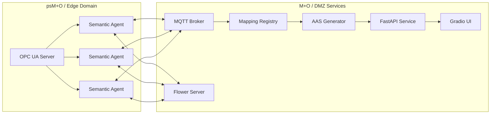

# NOA Semantic Swarm Mapper

[](https://github.com/hadijannat/semantic-swarm-intelligence/actions/workflows/ci.yml)
[](https://github.com/hadijannat/semantic-swarm-intelligence/releases)
[](LICENSE)

**Semantic Swarm Intelligence for Automated Tag Mapping**

A distributed, NOA-aligned toolchain that maps brownfield industrial tags to **PA-DIM / IEC 61987 IRDI semantics**, reaches **swarm consensus**, and exports **AAS artifacts**. Built for read-only safety, reproducibility, and publication-grade evaluation.

---

## Why this exists

NOA enables a second channel for plant data without touching control systems. The blocker is **semantic entropy**: heterogeneous tag names across vendors, eras, and sites. This project tackles that gap with a blend of **rule-based inference**, **ML fusion (CharCNN + GNN)**, **distributed consensus**, and **federated learning**, producing standardized semantics and AAS-ready exports.

---

## Core capabilities

- **OPC UA Discovery (read-only by default)** with backpressure and metadata extraction
- **Semantic inference**: rules + CharCNN + optional GNN fusion with calibrated confidences
- **Swarm consensus**: SWIM-style membership + MQTT gossip + confidence-weighted voting
- **Federated learning**: Flower FedProx, optional differential privacy hooks
- **Dictionary integration**: IEC CDD, eCl@ss, and curated seed concepts
- **AAS export**: JSON / XML / AASX via Eclipse BaSyx SDK
- **Observability**: Prometheus metrics, structured logging, correlation IDs

---

## Architecture



### Dataflow (high-level)
1. **Discover** tags via OPC UA (browse/read/subscribe only).
2. **Infer** IRDI candidates locally (rules + ML).
3. **Gossip** hypotheses via MQTT and membership metadata.
4. **Consensus** commits weighted vote results to registry.
5. **Export** AAS submodel artifacts for downstream tooling.

---

## Quickstart (Docker Compose)

```bash
make docker-up
```

Services:
- API: http://localhost:8000 (OpenAPI: `/docs`)
- UI: http://localhost:7860
- Flower: http://localhost:8080
- MQTT: localhost:1883
- Postgres: localhost:5432

Stop:
```bash
make docker-down
```

---

## Local Development

```bash
# Install dependencies
make install

# Run API server
poetry run uvicorn noa_swarm.api.main:app --reload
```

Start a semantic agent:
```bash
NOA_AGENT_ID=agent-001 \
NOA_OPCUA_ENDPOINT=opc.tcp://localhost:4840 \
MQTT_HOST=localhost \
poetry run python -m noa_swarm.swarm.agent
```

---

## Configuration

Use environment variables or YAML:

```yaml
# configs/dev.yaml
noa:
  agent_id: "agent-001"
  opcua:
    endpoint: "opc.tcp://localhost:4840"
    max_nodes_per_browse: 1000
  mqtt:
    host: "localhost"
    port: 1883
  ml:
    checkpoint_path: "models/best_model.pt"
    use_gnn: true
  consensus:
    min_votes: 2
    hard_quorum_threshold: 0.8
```

---

## API (selected endpoints)

Base URL: `http://localhost:8000`

| Domain | Endpoint | Method | Purpose |
|---|---|---|---|
| Health | `/health` | GET | Liveness check |
| Metrics | `/metrics` | GET | Prometheus scrape |
| Discovery | `/api/v1/discovery/status` | GET | Discovery status |
| Discovery | `/api/v1/discovery/start` | POST | Start OPC UA browse |
| Discovery | `/api/v1/discovery/nodes` | GET | Discovered nodes |
| Mapping | `/api/v1/mapping` | GET/POST | List/create mappings |
| Mapping | `/api/v1/mapping/{tag}` | GET/PUT/DELETE | CRUD mapping |
| Mapping | `/api/v1/mapping/{tag}/candidates` | GET | Candidate IRDIs |
| AAS | `/api/v1/aas/submodel` | GET | Submodel stats |
| AAS | `/api/v1/aas/export/{fmt}` | POST | AAS export (json/xml/aasx) |
| Swarm | `/api/v1/swarm/status` | GET | Swarm status |
| Swarm | `/api/v1/swarm/consensus` | GET | Consensus records |
| Federated | `/api/v1/federated/status` | GET | FL status |
| Federated | `/api/v1/federated/start` | POST | Start FL rounds |

Full schema at `/docs`.

---

## ML / Federated Learning

Train a baseline CharCNN:
```bash
make train
```

Reproducibility:
```bash
make benchmark
make reproduce
```

Key models:
- CharCNN for tag strings
- GNN for topology/context
- Fusion with temperature scaling calibration
- FedProx for non-IID federated learning

---

## AAS Export

Generate AAS packages from consensus outputs:
```bash
poetry run python scripts/export_aas.py --format aasx
```

Formats supported: `json`, `xml`, `aasx`.

---

## Testing & Quality Gates

```bash
make lint
make format
make typecheck
make test
```

CI runs: Ruff, Mypy, Pytest, coverage, packaging sanity, and Docker image build + smoke test.

---

## NOA Safety Defaults

- **Read-only by default**: OPC UA browsing + reading only.
- **Write-back** is intentionally out of scope unless explicitly configured.
- Designed for a **second-channel** data path per NOA principles.

---

## Repository Map

```
semantic-swarm-intelligence/
├── src/noa_swarm/
│   ├── aas/          # AAS export (BaSyx SDK)
│   ├── api/          # FastAPI application
│   ├── common/       # Config, logging, schemas, IRDI utilities
│   ├── connectors/   # OPC UA, MQTT, filesystem
│   ├── dictionaries/ # IEC CDD, eCl@ss, seed providers
│   ├── federated/    # Flower client/server, DP
│   ├── ml/           # Datasets, models, training, serving
│   ├── swarm/        # Agent, consensus, membership, reputation
│   └── ui/           # Gradio dashboard
├── docker/           # Dockerfiles + compose
├── configs/          # YAML configs
├── scripts/          # Tools & reproducibility
└── tests/            # Unit + integration
```

---

## Contributing

```bash
make check
```

Use Conventional Commits and open PRs with test evidence. Pre-commit includes a bidi-control guard to prevent hidden Unicode.

---

## License

MIT License — see [LICENSE](LICENSE).

## Security

Please review [SECURITY.md](SECURITY.md) for coordinated disclosure guidance.

## Citation

If you use this work in research, please cite the release tagged in GitHub Releases.
